# nx9-auth

<p align="center">

**Enterprise Identity & Access Management (IAM)**

*Self-Hosted • Privacy-First • Pure Rust • Single Binary • Linux Native*

[]()
[](https://www.rust-lang.org/)
[](LICENSE)
[]()
[]()
[]()

</p>

---

# nx9-auth

<div align="center">

**Enterprise Identity & Access Management (IAM) written entirely in Rust.**

Self-hosted • Privacy-first • Linux-native • Single Binary • Multi-Tenant • Open Source

---

*Part of the **NX9** ecosystem.*

</div>

---

## Overview

**nx9-auth** is a modern Identity & Access Management (IAM) server built entirely in **Rust**, designed for organizations that require secure, self-hosted authentication and authorization without the complexity of traditional enterprise IAM platforms.

Unlike heavyweight Java-based IAM systems, **nx9-auth** focuses on:

- Security first
- Operational simplicity
- Low resource usage
- Fast deployment
- Modern REST APIs
- Complete ownership of your data

The project is designed as the authentication foundation for the **NX9 ecosystem**, while remaining completely independent and reusable for any application.

---

# Dashboard

<p align="center">
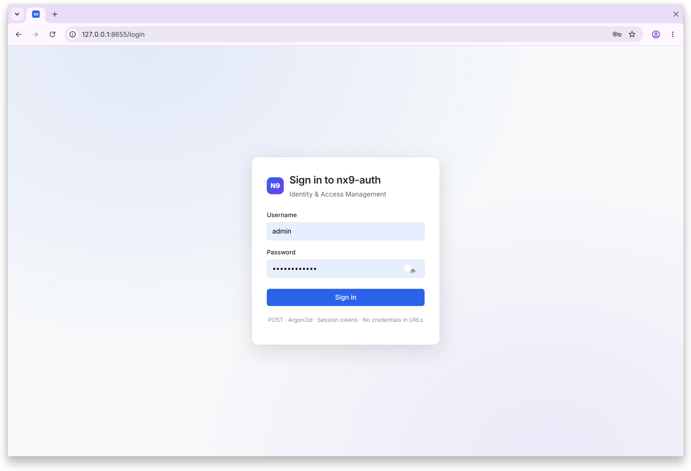
</p>

---

# Features

## Identity Management

- ✅ Multi-Tenant Architecture
- ✅ User Management
- ✅ User Profiles
- ✅ Groups
- ✅ Role Based Access Control (RBAC)
- ✅ Fine-grained Permissions
- ✅ Applications
- ✅ Service Accounts

## Authentication

- ✅ Username / Password
- ✅ Session Management
- ✅ API Tokens
- ✅ Personal Access Tokens
- ✅ Password Reset
- ✅ Secure Cookie Authentication

## Security

- ✅ Argon2id Password Hashing
- ✅ Session Revocation
- ✅ Token Revocation
- ✅ Security Headers
- ✅ Audit Logging
- ✅ Rate Limiting
- ✅ No Plaintext Password Storage
- ✅ No Plaintext Token Storage
- ✅ Transaction Rollback Protection

## Administration

- ✅ Dashboard
- ✅ Audit Viewer
- ✅ Settings
- ✅ Tenant Management
- ✅ Profile Management

## Database

- ✅ SQLite
- 🚧 PostgreSQL
- 🚧 MySQL

---

# Screenshots

## Login

<p align="center">
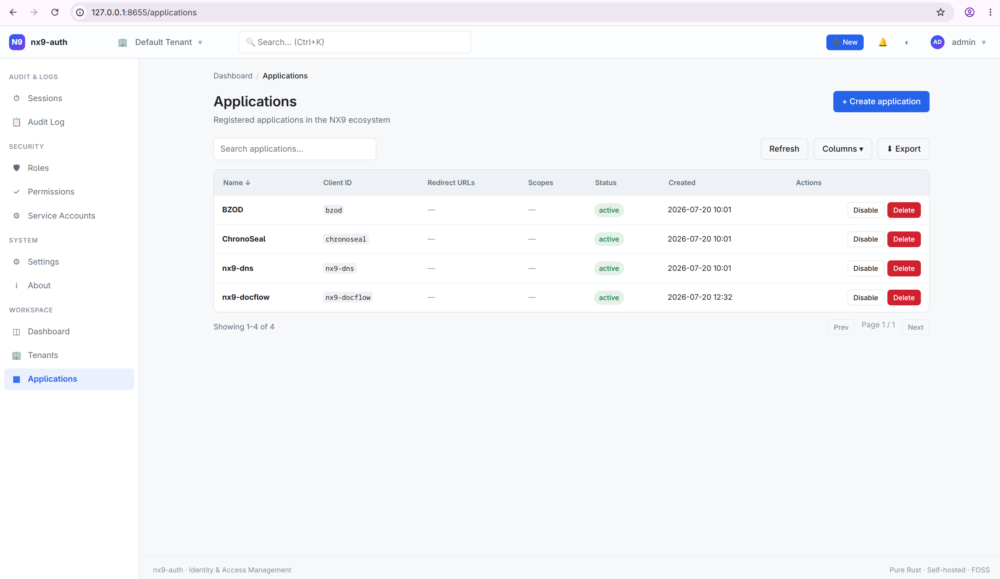
</p>

---

## Dashboard

<p align="center">

</p>

---

## Roles & Permissions

| Roles | Permissions |
|------|------|
| 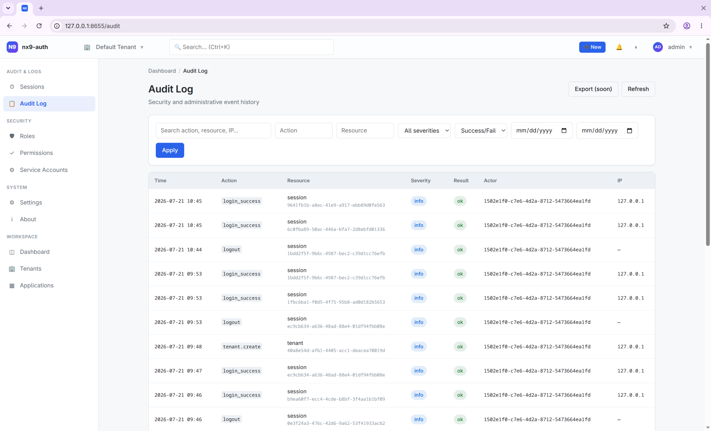 | 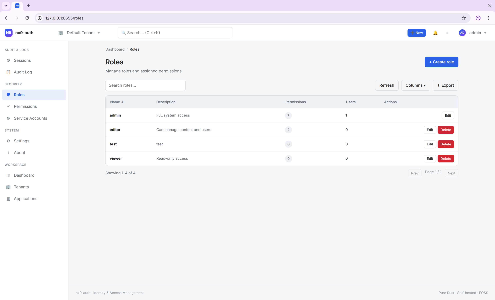 |

---

## Applications

| Applications | Create Application |
|------|------|
| 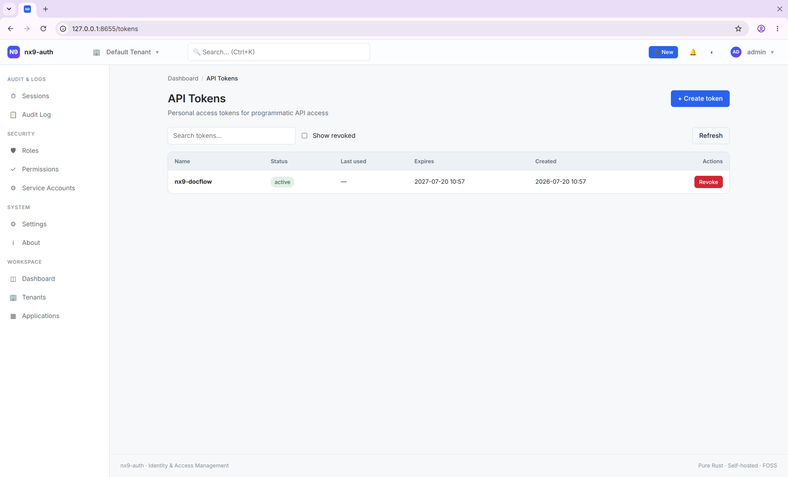 | 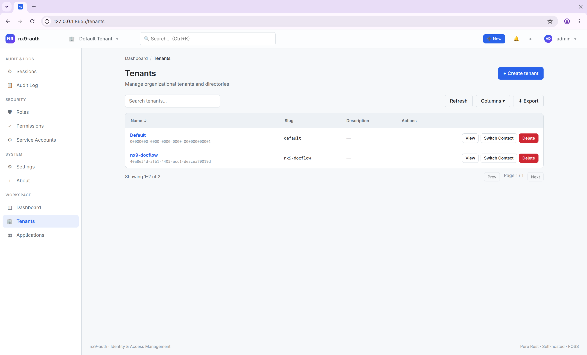 |

---

## Service Accounts

<p align="center">
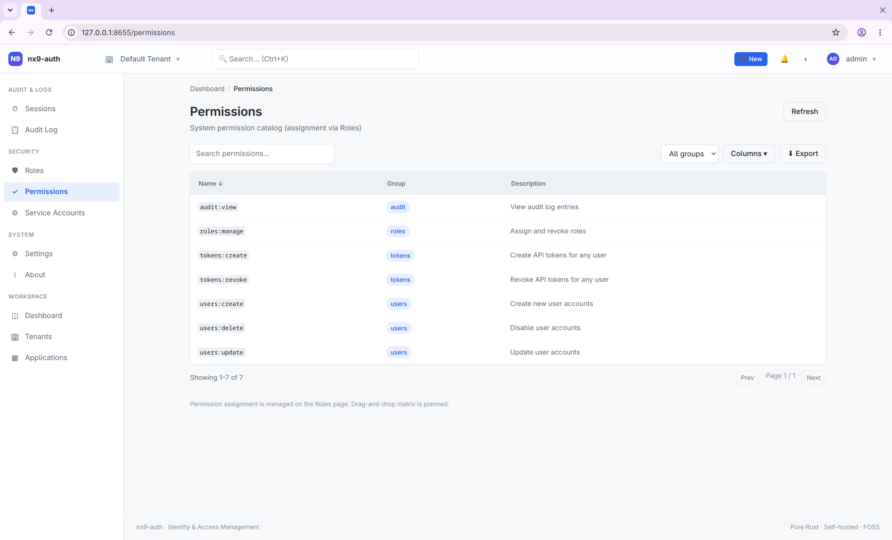
</p>

---

## Sessions

<p align="center">
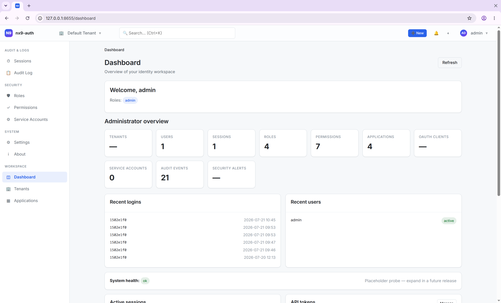
</p>

---

## API Tokens

<p align="center">
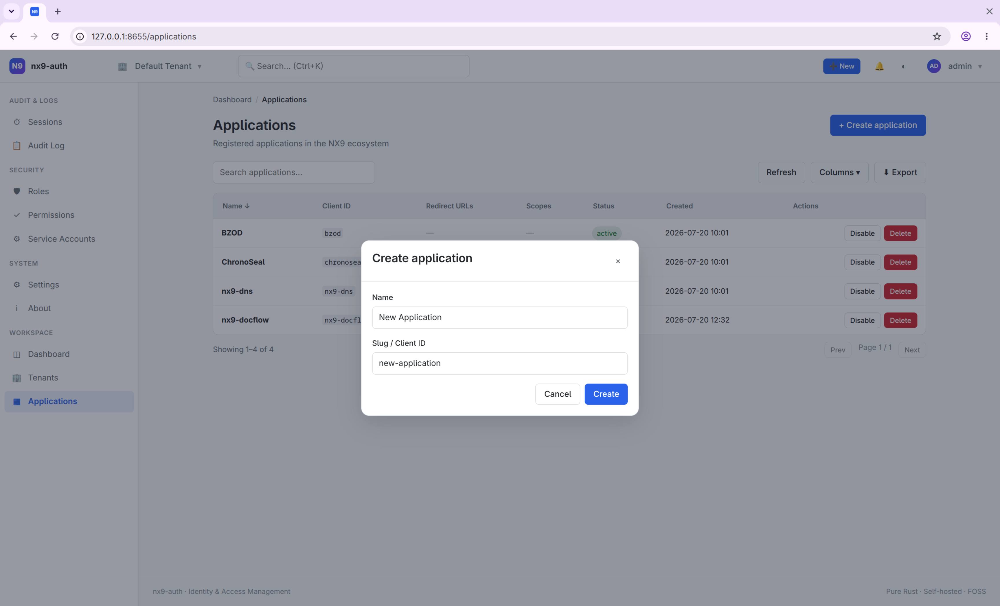
</p>

---

## Audit Log

<p align="center">
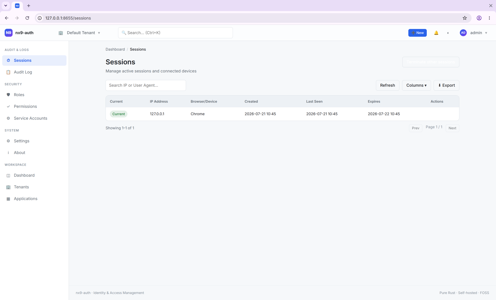
</p>

---

## Tenants

<p align="center">
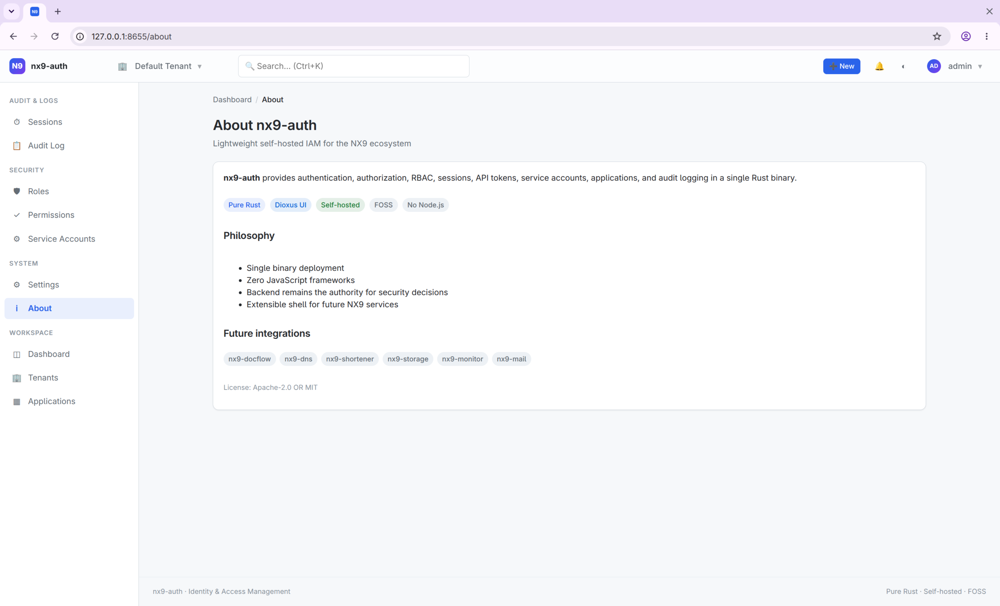
</p>

---

## Settings

<p align="center">
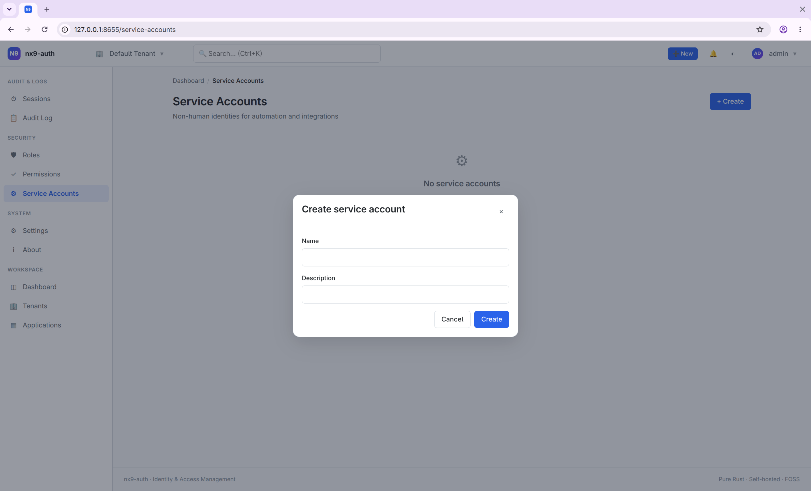
</p>

---

# Why nx9-auth?

| Traditional Enterprise IAM | nx9-auth |
|----------------------------|----------|
| Java based | Rust |
| Large memory footprint | Lightweight |
| Complex deployment | Single Binary |
| Multiple services | Minimal dependencies |
| Cloud-first | Self-hosted |
| Vendor lock-in | Open Source |
| Large attack surface | Minimal attack surface |

---

# Architecture

```
                Browser

                    │

                    ▼

            Dioxus Web UI (WASM)

                    │

                    ▼

              REST API (Axum)

                    │

                    ▼

          Authentication Layer

                    │

                    ▼

          Authorization (RBAC)

                    │

                    ▼

          Repository Layer

                    │

                    ▼

          Database Provider

                    │

        ┌───────────┴───────────┐
        │                       │
     SQLite                 PostgreSQL
     (Current)               (Planned)
```

---

# Technology Stack

| Component | Technology |
|------------|------------|
| Language | Rust |
| Backend | Axum |
| Frontend | Dioxus |
| Database | SQLite |
| Async Runtime | Tokio |
| Authentication | JWT + Cookies |
| Password Hashing | Argon2id |
| ORM | SQLx |
| Serialization | Serde |

---

# Quick Start

Clone the repository

```bash
git clone https://github.com/thakares/nx9-auth.git
cd nx9-auth
```

Build

```bash
cargo build --release
```

Initialize

```bash
./target/release/nx9-auth init
```

Run Setup Wizard

```bash
./target/release/nx9-auth setup
```

Start Server

```bash
./target/release/nx9-auth serve
```

Open

```
http://localhost:8655
```

---

# Configuration

Create your local configuration from the example:

```bash
cp config.example.toml config.toml
```

Then edit:

- Database
- Server
- Session
- Security
- SMTP
- Logging

---

# CLI

| Command | Description |
|----------|-------------|
| init | Initialize project |
| setup | Interactive setup wizard |
| serve | Start server |
| migrate | Run migrations |
| backup | Backup database |
| restore | Restore database |
| user | User management |
| token | API token management |

---

# REST API

| Endpoint | Description |
|-----------|-------------|
| /api/v1/auth | Authentication |
| /api/v1/users | Users |
| /api/v1/groups | Groups |
| /api/v1/roles | Roles |
| /api/v1/permissions | Permissions |
| /api/v1/applications | Applications |
| /api/v1/service-accounts | Service Accounts |
| /api/v1/sessions | Sessions |
| /api/v1/tokens | API Tokens |
| /api/v1/audit | Audit Logs |
| /api/v1/profile | Current User |
| /api/v1/dashboard | Dashboard |

---

# Docker

```bash
docker compose up -d
```

---

# CasaOS

```bash
docker compose -f compose.casaos.yml up -d
```

---

# Security

Security is a primary design goal.

Implemented features include:

- Argon2id password hashing
- Password strength validation
- Secure session cookies
- Session revocation
- API token hashing
- Audit logging
- Rate limiting
- Transaction rollback protection
- Security headers
- Authorization middleware
- RBAC
- Permission middleware
- No plaintext passwords
- No plaintext session tokens
- No plaintext API tokens

---

# Project Structure

```
docs/               Documentation
scripts/            Build & release scripts
src/                Backend
tests/              Integration tests
ui/                 Dioxus frontend

src/api             REST API
src/db              Database
src/security        Security
src/middleware      Middleware
src/identity        Identity services
src/config          Configuration
```

---

# Documentation

Additional documentation is available in the `docs/` directory.

- AUTHENTICATION.md
- BACKUPS.md
- BENCHMARKS.md
- DEPLOYMENT.md
- DOCKER.md
- INTEGRATION_BZOD.md

---

# Testing

Run all tests

```bash
cargo test
```

Run Clippy

```bash
cargo clippy --workspace --all-targets --all-features -- -D warnings
```

Run formatter

```bash
cargo fmt --all
```

---

# Current Status

| Feature | Status |
|-----------|--------|
| Authentication | ✅ |
| RBAC | ✅ |
| Sessions | ✅ |
| Audit Logs | ✅ |
| Applications | ✅ |
| Service Accounts | ✅ |
| API Tokens | ✅ |
| Dashboard | ✅ |
| SQLite | ✅ |
| PostgreSQL | 🚧 |
| OAuth2 | 🚧 |
| OpenID Connect | 🚧 |
| WebAuthn | 🚧 |
| MFA | 🚧 |

---

# Roadmap

## Version 0.2

- SQLite
- REST API
- Dashboard
- Multi-Tenant
- RBAC
- Sessions
- Audit Logging

## Version 0.3

- PostgreSQL
- Repository Improvements

## Version 0.4

- OAuth2
- OpenID Connect
- LDAP

## Version 0.5

- WebAuthn
- Multi-Factor Authentication

## Version 1.0

- Stable Enterprise Release

---

# Philosophy

The **NX9** ecosystem follows a simple philosophy:

- Self-hostable first
- Linux-native
- Privacy-first
- Open Source
- Minimal dependencies
- Operational simplicity
- Single binary where practical
- No vendor lock-in

---

# Contributing

Contributions are welcome.

Please:

1. Open an issue before major changes.
2. Follow Rust formatting (`cargo fmt`).
3. Ensure Clippy passes without warnings.
4. Add tests for new functionality.
5. Keep documentation up to date.

---

# License

Licensed under the MIT License.

---

<div align="center">

**nx9-auth** — Secure, self-hosted Identity & Access Management built with Rust.

Part of the **NX9** ecosystem.

</div>