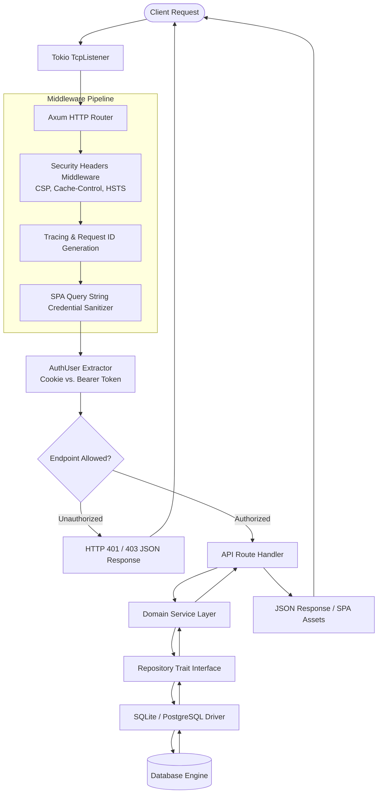
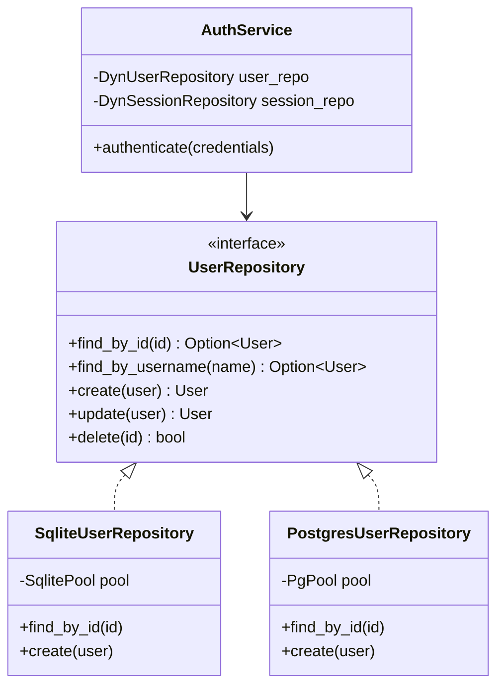
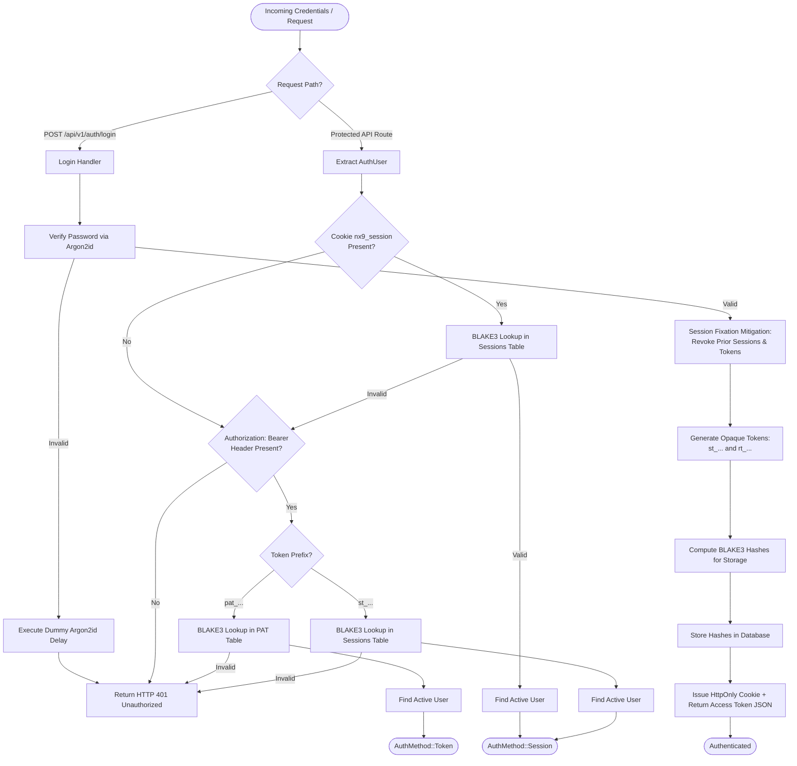
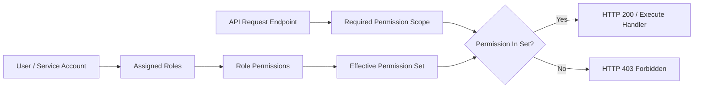
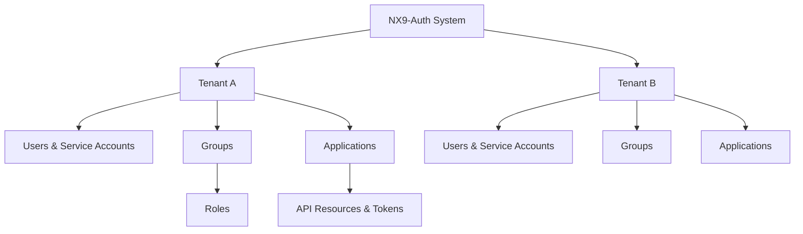

# NX9-Auth System Architecture Specification

---

## 1. System Overview & Executive Summary

**NX9-Auth** is a lightweight, high-performance, self-hosted Identity and Access Management (IAM) platform written entirely in pure Rust. It provides centralized authentication, fine-grained Role-Based Access Control (RBAC), multi-tenancy, service account management, personal access tokens (PATs), and append-only audit logging.

The system is architected as a modular, stateless HTTP server paired with a zero-JavaScript-framework WebAssembly (WASM) administration user interface. By executing natively on Linux systems without requiring external memory caches (e.g., Redis), JavaScript runtime environments (e.g., Node.js), or third-party web frameworks, NX9-Auth achieves minimal memory consumption, high throughput, zero garbage collection pauses, and operational simplicity.

---

## 2. Design Philosophy

NX9-Auth adheres strictly to eight core design tenets:

1. **Linux-First**: Native optimization for Linux environments, systemd process supervision, standard UNIX signals, and POSIX filesystem standards.
2. **Privacy-First**: No external telemetry, phone-home mechanisms, or third-party tracking. All identity records remain strictly under local operator control.
3. **Self-Hosted & FOSS**: Distributed as 100% Free and Open Source Software (FOSS) dual-licensed under Apache 2.0 and MIT.
4. **Rust-Native Integrity**: End-to-end type safety, compile-time memory safety, and thread concurrency guarantees across both server and WebAssembly client binaries.
5. **Zero Node.js Runtime**: No JavaScript runtime dependencies, npm build chains, or node_modules overhead. The frontend is compiled from Rust directly to WebAssembly.
6. **Minimal Dependencies**: Strict audit of external crates to maintain a minimal attack surface, fast compile times, and long-term maintenance stability.
7. **Operational Simplicity**: Single-binary deployment capability with embedded or external SQL databases. Zero mandatory external cache or message broker sidecars.
8. **Security by Default**: OWASP-aligned response headers, memory-hard Argon2id key derivation, BLAKE3 token hashing at rest, non-enumerating error responses, and strict Content Security Policies (CSP).

---

## 3. Architectural Principles

The internal architecture is guided by structural design patterns:

- **Layer Separation**: Downward-only dependency flow (`CLI` $\rightarrow$ `Runtime` $\rightarrow$ `Application` $\rightarrow$ `HTTP Router` $\rightarrow$ `Services` $\rightarrow$ `Repositories` $\rightarrow$ `Database`).
- **Dependency Inversion**: Service and handler layers depend on trait abstractions (`UserRepository`, `SessionRepository`) rather than concrete database drivers.
- **Repository Pattern**: Pluggable storage providers (SQLite, PostgreSQL) implementing unified async trait interfaces.
- **Configuration over Hardcoding**: Fail-fast configuration loading supporting configuration files, environment variable overrides, and CLI flags.
- **Stateless HTTP API**: Authentication state is encapsulated in cryptographically hashed session cookies or Bearer tokens, eliminating sticky-session server dependencies.
- **Fail-Fast Startup**: Early validation of configuration paths, database connectivity, and encryption parameters before opening listening sockets.
- **Graceful Shutdown**: Signal-driven, multi-stage shutdown sequence ensuring background worker completion, audit log flushing, and pool draining.
- **Explicit Error Handling**: Strongly typed error enumerations (`AppError`) mapping internal failures to standard HTTP status codes without leaking sensitive stack traces.

---

## 4. Technology Stack

| Component Layer | Technology Choice | Key Function & Architectural Role |
| :--- | :--- | :--- |
| **Language Ecosystem** | Rust | Core system implementation across server and WebAssembly client. |
| **Async Execution** | Tokio | Multi-threaded asynchronous I/O, timer management, and task scheduling. |
| **HTTP Routing** | Axum & Tower | Type-safe REST API routing, request extraction, and middleware pipelines. |
| **Database Abstraction** | SQLx | Asynchronous, compile-time verified database access for SQLite and PostgreSQL. |
| **Password Cryptography** | Argon2id | Memory-hard key derivation function for secure password verification. |
| **Token Hashing** | BLAKE3 | Fast cryptographic hashing for storing session tokens and PATs at rest. |
| **Rate Limiting** | DashMap | Lock-free, high-concurrency in-memory hash map for tracking IP failure counters. |
| **Frontend Framework** | Dioxus (WASM) | Declarative, signal-driven WebAssembly UI with virtual DOM reconciliation. |
| **WASM HTTP Client** | Reqwest (WASM) | WebAssembly HTTP fetch client configured for credentialed API interaction. |

---

## 5. Runtime Architecture

### 5.1 Runtime Core Components

The server runtime (`src/runtime/`) isolates process lifecycle management from business domain logic:

- **Application**: The core container holding state, connection pools, state trackers, and worker managers.
- **ApplicationBuilder**: Assembles configuration, initializes database providers, applies database migrations, and binds the router.
- **AtomicRuntimeState**: Lock-free atomic state machine enforcing valid lifecycle transitions.
- **SignalManager**: Asynchronous signal listener intercepting `SIGINT` and `SIGTERM`.
- **ShutdownCoordinator**: Manages prioritized shutdown hooks and completion timeouts.
- **WorkerManager**: Supervises background asynchronous tasks (e.g., expired session pruning, audit log flushing).
- **HookRegistry**: Maintains prioritized cleanup routines executed during graceful shutdown.
- **RuntimeMetrics**: Tracks runtime uptime, active connections, and worker states.

### 5.2 Deterministic Lifecycle State Machine

```mermaid
stateDiagram-v2
    [*] --> Initializing : ApplicationBuilder::build()
    Initializing --> Starting : Application::start()
    Starting --> Running : TcpListener Bound & axum::serve Awaited
    Running --> Draining : SIGINT / SIGTERM Received
    Draining --> StoppingWorkers : Background Workers Signaled
    StoppingWorkers --> ExecutingHooks : Prioritized Shutdown Hooks Executed
    ExecutingHooks --> ClosingResources : Database Connection Pools Drained
    ClosingResources --> Stopped : Process Terminates Cleanly
    Stopped --> [*]
```

### 5.3 Prioritized Shutdown Sequence

When a termination signal is received, the runtime executes hooks sequentially by tier:

1. **ShutdownPriority::First**: Closes HTTP ingress listener and stops receiving new connections.
2. **ShutdownPriority::Normal**: Cancels active background worker loops and awaits inflight jobs.
3. **ShutdownPriority::Last**: Flushes pending audit trails and closes database pool connections.

---

## 6. Request Lifecycle & Pipeline Architecture

Every incoming HTTP request traverses a strict layered middleware pipeline:



---

## 7. Repository & Database Architecture

### 7.1 Repository Abstraction Layer

NX9-Auth decouples persistence logic from domain services using Rust traits (`async_trait`). This guarantees that API handlers remain agnostic of the underlying database engine.



### 7.2 Database Engines & Schema Migrations

- **SQLite**: Default embedded database provider using WAL (Write-Ahead Logging) mode and busy timeout management for high concurrency.
- **PostgreSQL**: Production multi-node provider for enterprise environments.
- **Migration System**: Managed via SQLx embedded migrations executed automatically during startup, guaranteeing schema consistency across upgrades.

---

## 8. Authentication Architecture

NX9-Auth supports dual-mode authentication, accommodating both web browser clients (via HttpOnly cookies) and API consumers / SPA applications (via Bearer tokens).



### 8.1 Key Authentication Mechanisms
- **Session Tokens (`st_...`)**: Short-lived opaque session tokens returned on login and stored in HttpOnly cookies or client memory.
- **Refresh Tokens (`rt_...`)**: Opaque tokens used to issue new session tokens without re-entering primary credentials.
- **Personal Access Tokens (`pat_...`)**: Long-lived API tokens generated by users for automated integrations, hashed at rest using BLAKE3.
- **Service Accounts**: Non-human identities bound to specific tenants and limited permission scopes for automated workloads.

---

## 9. Authorization Model (RBAC)

NX9-Auth implements a hierarchical Role-Based Access Control (RBAC) model:



### Authorization Rules
- **Super Admin (`*`)**: Universal access across all tenants and administrative APIs.
- **Tenant Admin**: Administrative authority scoped strictly to resources owned by their tenant.
- **Viewer / Standard User**: Read-only access or limited domain operation privileges.
- **Permission Evaluation**: Resolved during the handler phase after successful `AuthUser` extraction.

---

## 10. Security Architecture

NX9-Auth enforces a defense-in-depth security posture:

```
┌────────────────────────────────────────────────────────────────────────┐
│                        HTTP Response Layer                             │
│   Strict CSP (script-src 'self' 'wasm-unsafe-eval') | Cache-Control    │
│   HSTS | X-Frame-Options: DENY | Referrer-Policy: no-referrer          │
└────────────────────────────────────────────────────────────────────────┘
                                   │
┌────────────────────────────────────────────────────────────────────────┐
│                       Transport & Sanitization                         │
│   GET Query Credential Interceptor (HTTP 303 Redirect Sanitizer)       │
│   In-Memory Rate Limiting (DashMap Exponential IP Lockout)             │
└────────────────────────────────────────────────────────────────────────┘
                                   │
┌────────────────────────────────────────────────────────────────────────┐
│                     Cryptographic Storage Layer                        │
│   Argon2id (m=19456 KiB, t=2, p=1) Password Key Derivation             │
│   BLAKE3 Opaque Token Hashing at Rest (Sessions, Refresh, PATs)        │
└────────────────────────────────────────────────────────────────────────┘
                                   │
┌────────────────────────────────────────────────────────────────────────┐
│                         Audit & Observability                          │
│   Append-Only Tamper-Evident Audit Logging (actor, target, severity)   │
└────────────────────────────────────────────────────────────────────────┘
```

- **Non-Enumerating Authentication Errors**: Password failures and non-existent usernames return identical HTTP 401 error payloads and invoke Argon2id execution paths to neutralize timing side-channels.
- **Query Parameter Credential Protection**: Server-side fallback handlers strip any query strings containing sensitive credentials (`username=`, `password=`) and issue immediate HTTP 303 redirects to clean paths.

---

## 11. Multi-Tenancy & Resource Hierarchy

Resources are hierarchically structured to ensure data isolation:



### Data Isolation Guarantees
- Every database query for tenant-scoped entities contains explicit `WHERE tenant_id = ?` filters.
- Service accounts and applications are strictly bound to their parent tenant ID and cannot cross boundaries.

---

## 12. Frontend Architecture (WebAssembly SPA)

The administration interface is implemented as a pure WebAssembly Single Page Application (SPA) using Dioxus 0.6:

```mermaid
flowchart TD
    Browser[Web Browser] --> IndexHTML[index.html]
    IndexHTML --> BootJS[assets/boot.js]
    BootJS --> WASMModule[nx9_auth_ui_bg.wasm]
    
    subgraph DioxusWASM [" Dioxus WebAssembly Engine "]
        VDOM[Virtual DOM Engine]
        SignalState[Signal State Management]
        Router[Dioxus Router]
    end
    
    WASMModule --> DioxusWASM
    
    subgraph EventSystem [" Dual Event Interception Protocol "]
        FormSubmit[Form onsubmit Listener] --> PreventDefault[evt.prevent_default()]
        ButtonClick[Button onclick Listener] --> PreventDefault
        PreventDefault --> WASMFetch[WASM Reqwest fetch()]
    end

    DioxusWASM --> EventSystem
    WASMFetch -- "Content-Type: application/json\nfetch_credentials_include()" --> BackendAPI[NX9-Auth Axum REST API]
```

---

## 13. Configuration System

NX9-Auth loads configuration using a multi-tiered fallback hierarchy:

```
1. Explicit CLI Flags (--config /path/to/config.toml)
       │
       ▼
2. Environment Variables (NX9_SERVER__PORT, NX9_DATABASE__URL)
       │
       ▼
3. Local Configuration Files (./config.toml, /etc/nx9-auth/config.toml)
       │
       ▼
4. Compiled Default Fallbacks
```

### Validation & Startup Safeguards
- Configuration loading performs instant fail-fast validation. If database URIs are malformed or TLS configurations are invalid, process execution halts immediately with explicit error logging before binding network ports.

---

## 14. Deployment Architecture

NX9-Auth is deployed as a single, self-contained Linux executable:

```mermaid
flowchart LR
    Internet([Internet / Clients]) --> ReverseProxy[Reverse Proxy\nNginx / Caddy / Traefik\n(TLS Termination)]
    ReverseProxy -- HTTP / Unix Socket --> AppService[NX9-Auth Binary\nSystemd Supervised Service]
    AppService <--> SQLite[SQLite Database File\n(WAL Mode)]
    AppService <--> Postgres[(PostgreSQL Server)]
```

### Systemd Process Supervision Example (`nx9-auth.service`)
```ini
[Unit]
Description=NX9-Auth Identity & Access Management Server
After=network.target

[Service]
Type=simple
User=nx9-auth
Group=nx9-auth
ExecStart=/usr/local/bin/nx9-auth serve --config /etc/nx9-auth/config.toml
Restart=on-failure
RestartSec=5s
LimitNOFILE=65536
CapabilityBoundingSet=
NoNewPrivileges=true
ProtectSystem=strict
ProtectHome=true
ReadWritePaths=/var/lib/nx9-auth

[Install]
WantedBy=multi-user.target
```

---

## 15. Repository Directory Layout

```text
/
├── Cargo.toml               # Primary Cargo workspace manifest
├── Cargo.lock               # Dependency lockfile
├── build.rs                 # Build script for static asset embedding
├── README.md                # Project documentation overview
├── LICENSE                  # Dual license declaration (MIT OR Apache-2.0)
├── LICENSE-MIT              # MIT License terms
├── LICENSE-APACHE           # Apache 2.0 License terms
├── src/                     # Core backend source directory
│   ├── main.rs              # Binary entry point and CLI subcommand dispatcher
│   ├── lib.rs               # Library root exporting domain modules
│   ├── api/                 # Axum REST API handlers and routing table
│   ├── audit/               # Audit trail logging service and DTOs
│   ├── cli/                 # Clap CLI subcommand implementations
│   ├── config/              # Configuration file parsing and environment loaders
│   ├── db/                  # SQLx database abstraction layers and migrations
│   ├── error/               # Strongly typed application error enumerations
│   ├── identity/            # User, role, group, and tenant management services
│   ├── middleware/          # Security headers, authentication, and logging middlewares
│   ├── runtime/             # Application lifecycle, state machine, and signal hooks
│   └── security/            # Argon2id, BLAKE3, and rate-limiting modules
├── ui/                      # WebAssembly Frontend crate (Dioxus 0.6)
│   ├── Cargo.toml           # UI package crate manifest
│   ├── index.html           # SPA entry point template
│   ├── assets/              # Static styling and JavaScript boot loader
│   └── src/                 # Dioxus components, routes, and services
├── tests/                   # Integration and end-to-end security test suites
├── scripts/                 # Maintenance, build, and release helper scripts
├── deploy/                  # Containerization, systemd, and reverse-proxy templates
└── docs/                    # Architecture guides, ADRs, and technical specifications
```

---

## 16. Architectural Roadmap & Future Capabilities

The following capabilities represent planned architectural extensions:

- **OpenID Connect (OIDC) & OAuth2 Provider**: Expanding identity capabilities to act as a full OIDC Authorization Server and Identity Provider (IdP).
- **WebAuthn / FIDO2 Passkeys**: Native passwordless authentication support using browser WebAuthn APIs.
- **Multi-Factor Authentication (MFA)**: Time-based One-Time Password (TOTP) integration using standard RFC 6238 algorithms.
- **SCIM 2.0 & Directory Sync**: System for Cross-domain Identity Management (SCIM) for automated user provisioning.
- **Observability Exports**: OpenTelemetry metrics and tracing exporters for Prometheus and Grafana monitoring stacks.
- **High-Availability Clustering**: Distributed session cache synchronization across multi-region server nodes.
