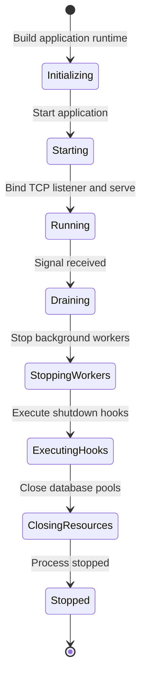
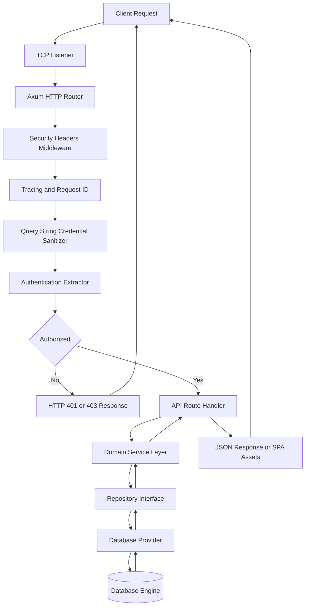
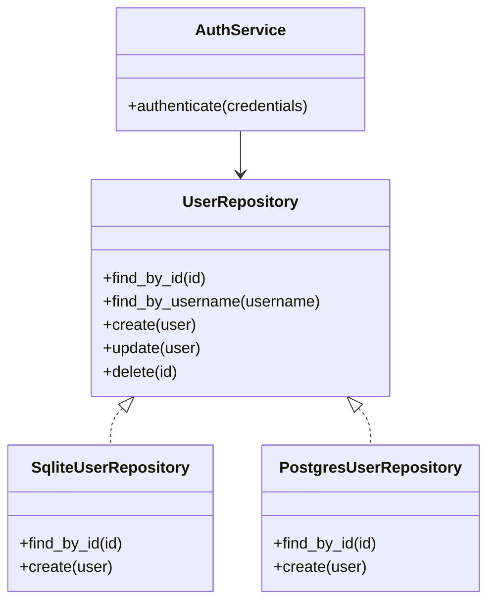
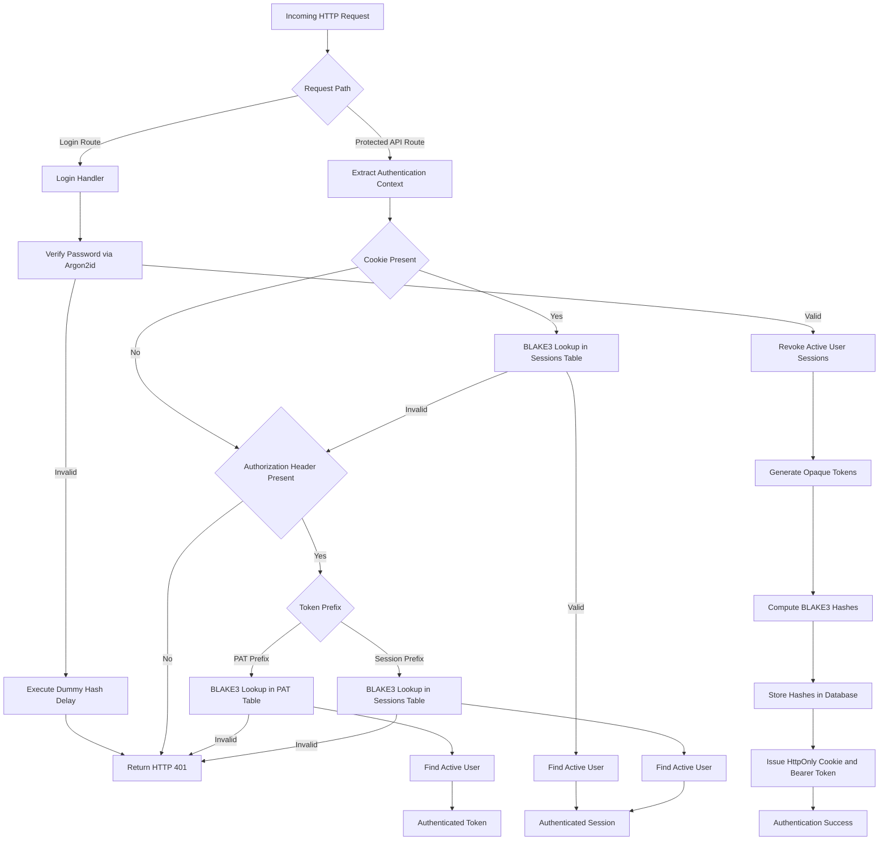
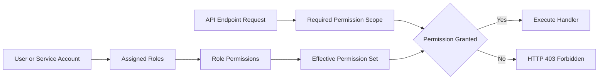
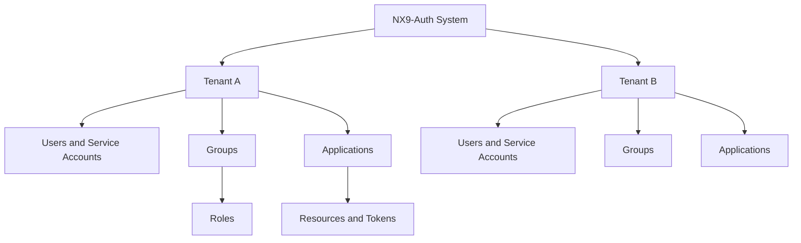
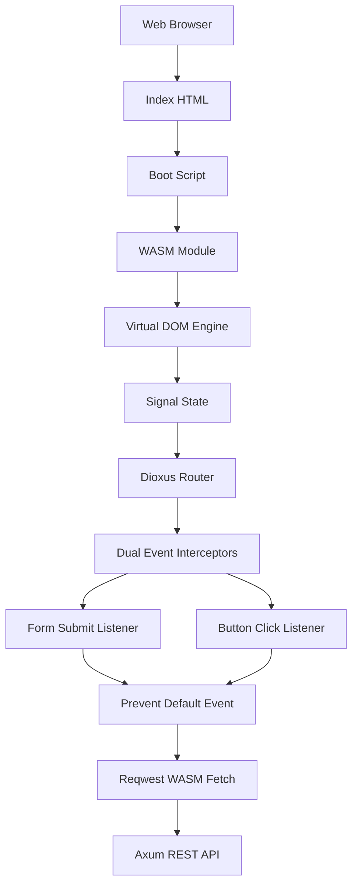
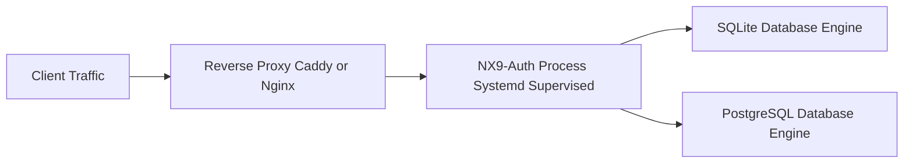

# 1. System Overview

NX9-Auth is a self-hosted Identity and Access Management (IAM) server written in pure Rust. It provides centralized authentication, fine-grained Role-Based Access Control (RBAC), multi-tenancy, service account management, personal access tokens (PATs), and append-only audit logging.

The system is architected as a stateless HTTP server paired with a zero-JavaScript-framework WebAssembly (WASM) administration user interface. Executing natively on Linux operating systems without external memory caches, JavaScript runtimes, or third-party web frameworks, NX9-Auth achieves low memory consumption, high throughput, zero garbage collection pauses, and operational simplicity.

Supported deployment models include single-binary installations, systemd-managed services, containerized workloads, and reverse-proxy setups using embedded SQLite or external PostgreSQL database engines.

---

# 2. Design Philosophy

NX9-Auth adheres to seven core design tenets:

- **Linux-First**: Native optimization for Linux operating systems, systemd process supervision, standard UNIX signal handling, and POSIX filesystem standards.
- **Privacy-First**: Zero external telemetry, phone-home calls, or third-party tracking. All identity records remain strictly under local operator control.
- **Self-Hosted**: Distributed as 100% Free and Open Source Software (FOSS) dual-licensed under Apache 2.0 and MIT.
- **Rust-Native**: End-to-end type safety, compile-time memory safety, and thread concurrency guarantees across both server and WebAssembly client binaries.
- **Security by Default**: OWASP-aligned response headers, memory-hard Argon2id key derivation, BLAKE3 token hashing at rest, non-enumerating error responses, and strict Content Security Policies.
- **Zero Node.js Runtime**: No JavaScript runtime dependencies, npm build chains, or external frontend node packages. The administrative interface is compiled from Rust directly to WebAssembly.
- **Operational Simplicity**: Single-binary deployment capability with embedded or external SQL databases. Zero mandatory external cache or message broker sidecars.

---

# 3. Architectural Principles

The internal architecture is guided by structural design patterns:

- **Layer Separation**: Downward-only dependency flow from entry points to persistence drivers.
- **Repository Pattern**: Pluggable storage providers implementing unified async trait interfaces.
- **Dependency Inversion**: Service and handler layers depend on trait abstractions rather than concrete database drivers.
- **Stateless APIs**: Authentication state is encapsulated in cryptographically hashed session cookies or Bearer tokens, eliminating sticky-session server dependencies.
- **Explicit Errors**: Strongly typed error enumerations mapping internal failures to standard HTTP status codes without leaking sensitive stack traces.
- **Fail-Fast Startup**: Early validation of configuration paths, database connectivity, and encryption parameters before opening listening sockets.
- **Graceful Shutdown**: Signal-driven, multi-stage shutdown sequence ensuring background worker completion, audit log flushing, and pool draining.

---

# 4. Technology Stack

### Backend
- **Core Language**: Rust (2024 Edition)
- **Async Runtime**: Tokio
- **HTTP Routing**: Axum and Tower
- **Database Engine**: SQLx (supporting SQLite and PostgreSQL)

### Frontend
- **UI Framework**: Dioxus (WebAssembly compilation target)
- **WASM Interop**: wasm-bindgen
- **HTTP Client**: Reqwest (configured for credentialed WebAssembly fetch operations)
- **Browser Storage**: gloo-storage

### Cryptography & Security
- **Password Hashing**: Argon2id
- **Token Hashing**: BLAKE3
- **Rate Limiting**: DashMap (lock-free in-memory tracking)

---

# 5. Runtime Architecture

The server runtime isolates process lifecycle management from business domain logic.

### Components
- **Application**: Core container holding global state, connection pools, state trackers, and worker managers.
- **Builder**: Assembles configuration, initializes database providers, applies database migrations, and binds the router.
- **Lifecycle**: Manages application state transitions from initialization to termination.
- **State**: Lock-free atomic state machine enforcing valid lifecycle transitions.
- **Workers**: Supervises background asynchronous tasks such as expired session pruning and audit log flushing.
- **Signals**: Asynchronous signal listener intercepting SIGINT and SIGTERM.
- **Hooks**: Maintains prioritized cleanup routines executed during graceful shutdown.
- **Metrics**: Tracks runtime uptime, active connections, and worker states.
- **Shutdown**: Manages prioritized shutdown hooks and completion timeouts.



---

# 6. Request Lifecycle

Every incoming HTTP request traverses a structured, layered processing pipeline.



---

# 7. Repository Architecture

NX9-Auth decouples persistence logic from domain services using trait abstractions. This ensures API handlers remain agnostic of the underlying storage backend.

### Layer Hierarchy
1. **Traits**: Define high-level database access contracts.
2. **SQLite Implementation**: Embedded storage driver using Write-Ahead Logging for high concurrency.
3. **PostgreSQL Implementation**: Enterprise storage driver for external multi-node deployments.
4. **Service Layer**: Coordinates business logic, transactions, and audit trail records across repositories.



---

# 8. Authentication

NX9-Auth supports dual-mode authentication, accommodating both browser environments and automated API clients.

### Authentication Credentials and Identifiers
- **Login Handler**: Accepts JSON credential payloads and validates passwords using Argon2id.
- **Password Verification**: Memory-hard verification with constant-time dummy delays on invalid usernames to neutralize timing side-channels.
- **Sessions**: Short-lived opaque session tokens issued upon login and stored as BLAKE3 hashes at rest.
- **Refresh Tokens**: Opaque refresh tokens used to obtain new session tokens without re-entering credentials.
- **Personal Access Tokens (PAT)**: Long-lived tokens generated for automated API integrations.
- **Service Accounts**: Non-human identities bound to specific tenants and permission scopes.
- **Cookies**: HttpOnly, SameSite-protected cookies holding session identifiers for browser clients.
- **Bearer Tokens**: Authorization header tokens for API consumers and WebAssembly applications.



---

# 9. Authorization

NX9-Auth implements a hierarchical Role-Based Access Control (RBAC) authorization model.



---

# 10. Security

NX9-Auth enforces a defense-in-depth security posture across all subsystems:

- **Argon2id Key Derivation**: Memory-hard password hashing parameters (m=19456 KiB, t=2, p=1).
- **BLAKE3 Cryptographic Hashing**: High-speed cryptographic hashing for storing session tokens, refresh tokens, and personal access tokens at rest.
- **Secure Cookie Attributes**: HttpOnly, SameSite=Lax, and Secure flag enforcement in production environments.
- **Content Security Policy (CSP)**: Strict header policy prohibiting inline script execution while allowing WebAssembly evaluation.
- **HTTP Strict Transport Security (HSTS)**: Transport security header enforcement when running under secure configurations.
- **Audit Logging**: Append-only, tamper-evident audit trail capturing actor, target, severity, IP address, and user agent.
- **Rate Limiting**: Lock-free in-memory IP tracking with automatic lockout penalties upon consecutive failure thresholds.
- **Credential Sanitization**: Fallback routes intercept and strip query strings containing credentials, returning HTTP 303 redirects to clean paths.

---

# 11. Multi-tenancy

Resources are hierarchically isolated to enforce strict multi-tenant data boundaries.



### Data Isolation Rules
- Database queries for tenant-scoped entities enforce explicit tenant filters.
- Service accounts and applications are strictly bound to their parent tenant identifier.

---

# 12. Frontend

The administrative user interface is implemented as a WebAssembly Single Page Application (SPA) built with Dioxus.



---

# 13. Configuration

NX9-Auth manages system parameters through a hierarchical configuration system.

### Configuration Precedence Order
1. Command Line Interface (CLI) Arguments
2. Environment Variables
3. Configuration Files (TOML format)
4. Built-in Defaults

Startup execution validates configuration parameters immediately. If configuration paths, database URIs, or security options fail validation, process startup halts with explicit error messages before network ports are bound.

---

# 14. Deployment

NX9-Auth is deployed as a single self-contained executable on Linux systems, supervised by systemd and situated behind a reverse proxy.



### Process Supervision Overview
Systemd handles process lifetime, automatic restarts, resource limits, and security sandboxing (such as restricting filesystem access and disabling privilege escalation). Standard deployment files reside in `deploy/systemd/nx9-auth.service`.

---

# 15. Repository Layout

```text
/
├── Cargo.toml               # Primary Cargo workspace configuration
├── Cargo.lock               # Dependency version lockfile
├── build.rs                 # Static asset embedding build script
├── README.md                # Project landing documentation
├── LICENSE                  # Dual license declaration
├── LICENSE-MIT              # MIT License text
├── LICENSE-APACHE           # Apache 2.0 License text
├── src/                     # Core backend source files
│   ├── main.rs              # Entry point and subcommand router
│   ├── lib.rs               # Library root exporting domain modules
│   ├── api/                 # REST API handlers and endpoint routes
│   ├── audit/               # Audit trail service and data structures
│   ├── cli/                 # CLI command parsing logic
│   ├── config/              # Configuration file parsing and environment logic
│   ├── db/                  # SQLx abstractions and migration files
│   ├── error/               # Application error types
│   ├── identity/            # User, role, group, and tenant domain services
│   ├── middleware/          # Security header and authentication middlewares
│   ├── runtime/             # Lifecycle, state machine, and signal handlers
│   └── security/            # Password hashing, token hashing, and rate limiting
├── ui/                      # WebAssembly frontend crate (Dioxus)
├── tests/                   # Integration and security test suites
├── scripts/                 # Maintenance and build helper scripts
├── deploy/                  # Systemd service files and deployment templates
└── docs/                    # Architecture documents and technical specifications
```

---

# 16. Future Roadmap

Planned future architectural extensions include:

- **OpenID Connect (OIDC) & OAuth2 Server**: Native implementation enabling NX9-Auth to function as a full OIDC Authorization Server.
- **SAML 2.0 Support**: Enterprise federation support for identity provider integrations.
- **SCIM 2.0 Provisioning**: System for Cross-domain Identity Management interface for automated user synchronization.
- **Directory Integration**: LDAP and Active Directory authentication capability.
- **Multi-Factor Authentication (MFA)**: TOTP (RFC 6238) and WebAuthn / FIDO2 passkey support.
- **High-Availability Clustering**: Distributed session cache synchronization across multi-region server nodes.
- **Observability Exporters**: Native OpenTelemetry metrics and tracing integration for Prometheus and Grafana monitoring stacks.
