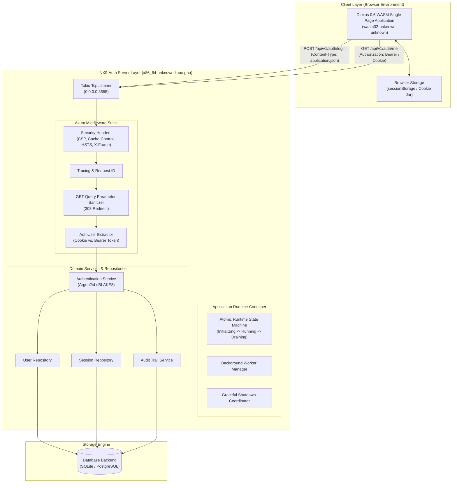
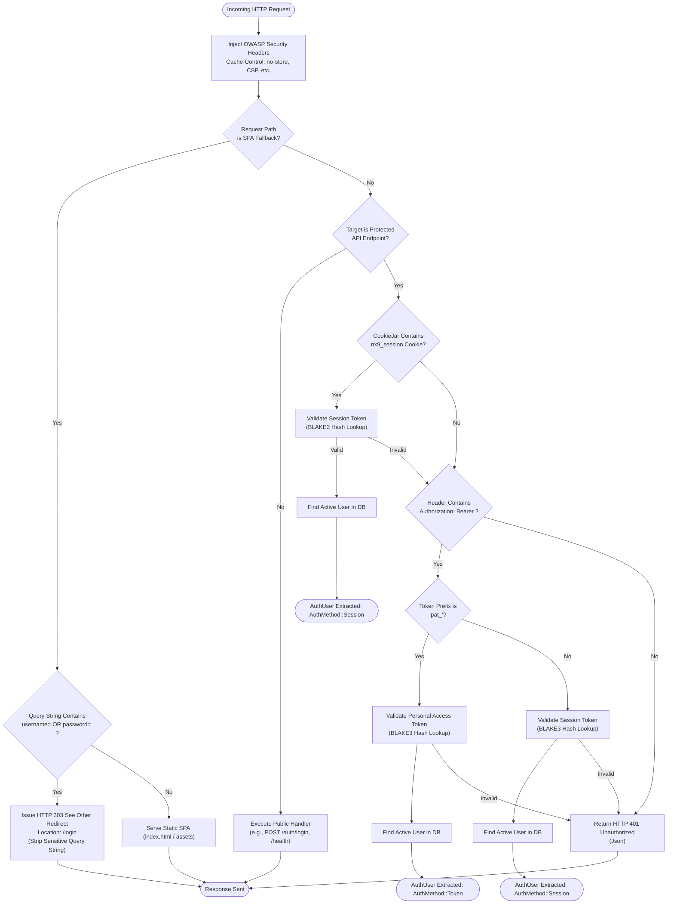
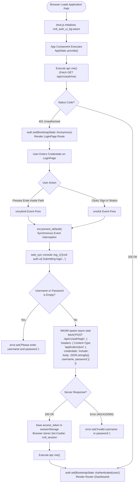

# NX9-Auth v0.3.0 — Comprehensive Technical Specification, Architecture & Engineering Report

---

## 1. Executive Summary & System Metadata

**NX9-Auth** is a lightweight, high-performance, self-hosted Identity & Access Management (IAM) server written in pure Rust. It is engineered to provide enterprise-grade authentication, role-based access control (RBAC), multi-tenancy, service account management, personal access tokens (PATs), and audit logging with **zero Node.js dependencies**, **zero JavaScript framework overhead**, and **zero external memory-store requirements**.

### System Attributes
- **Target Release Version**: `v0.3.0`
- **Codename**: Architectural Recovery & Security Stabilization
- **License**: Dual-Licensed under **MIT** (LICENSE-MIT) OR **Apache-2.0** (LICENSE-APACHE)
- **Primary Binary Target**: `x86_64-unknown-linux-gnu` (Static Linux / glibc / musl compatible)
- **Frontend Target**: `wasm32-unknown-unknown` (Dioxus 0.6 WebAssembly Single Page Application)
- **Rust Edition**: `2024` (MSRV: `1.85+`)
- **Verification Status**: **77 / 77 Workspace Integration & Unit Tests Passing** | Zero Clippy Warnings | Zero Content Security Policy (CSP) Violations

---

## 2. Technology Stack & Component Matrix

### 2.1 Backend Stack (`x86_64-unknown-linux-gnu`)

| Layer | Component | Version | Rationale & Architectural Purpose |
| :--- | :--- | :--- | :--- |
| **Core Language** | Rust | `1.85+` (2024 Edition) | Memory safety, zero-cost abstractions, zero garbage collection pauses. |
| **Async Runtime** | Tokio | `v1.52.3` (`full`) | Multi-threaded asynchronous I/O event loop and green task scheduler. |
| **HTTP Framework** | Axum | `v0.8.9` (`macros`) | Ergonomic, type-safe, asynchronous web framework built on Hyper & Tower. |
| **HTTP Utilities** | Tower / Tower-HTTP | `v0.5` / `v0.6.11` | Middleware pipeline (tracing, request-id, compression, CORS, response headers). |
| **Database Engine** | SQLx | `v0.9.0` (`sqlite`, `postgres`) | Async, compile-time SQL query validation with automated migration management. |
| **Password Hashing** | Argon2 | `v0.5.3` | OWASP-recommended memory-hard key derivation function (Argon2id). |
| **Token Hashing** | BLAKE3 | `v1.8.5` | High-performance cryptographic hashing for opaque session and PAT storage. |
| **Rate Limiting** | DashMap | `v6.0` | High-concurrency lock-free in-memory hash map for rate limiting. |
| **CLI Parser** | Clap | `v4.6.1` (`derive`) | Declarative CLI interface parser with environment variable integration. |
| **Structured Logging**| Tracing | `v0.1` / `v0.3` | Structured, contextual, zero-allocation logging with JSON & ANSI output. |

### 2.2 Frontend Stack (`wasm32-unknown-unknown`)

| Layer | Component | Version | Rationale & Architectural Purpose |
| :--- | :--- | :--- | :--- |
| **UI Framework** | Dioxus | `v0.6.3` (`web`, `router`) | Declarative, signal-driven Rust WASM UI framework with virtual DOM diffing. |
| **WASM Interop** | `wasm-bindgen` | `v0.2.126` | High-level bindings between Rust WebAssembly and browser Web APIs. |
| **HTTP Client** | Reqwest | `v0.12.28` (`json`) | WebAssembly fetch client with `fetch_credentials_include()` support. |
| **Browser Storage** | `gloo-storage` | `v0.3` | Type-safe wrapper for browser `sessionStorage` and `localStorage`. |
| **Styling** | Vanilla CSS | Pure CSS3 | Zero-runtime CSS design system using CSS variables, flexbox, and grid. |

---

## 3. System Architecture & Flowchart Suite

### 3.1 End-to-End System Architecture



---

### 3.2 HTTP Request Lifecycle & Authentication Extractor Flowchart



---

### 3.3 WASM Single Page Application Bootstrapping & Dual Event Flowchart



---

## 4. Cryptographic Algorithms & Security Protocols

### 4.1 Password Hashing Specification (Argon2id)

Passwords are never stored in plaintext, logged, echoed, or included in URLs. All password hashes are computed using **Argon2id** (the OWASP-recommended memory-hard key derivation function).

$$\text{PasswordHash} = \text{Argon2id}\Big(\text{Password}, \text{Salt}_{\text{CSPRNG}}, m=19456\text{ KiB}, t=2, p=1\Big)$$

#### Password Verification & Timing-Attack Mitigation Algorithm
To prevent timing-based username enumeration attacks, user lookup always executes a comparable amount of work regardless of whether the username exists in the database:

```rust
// Pseudocode of src/api/auth.rs: login
let user_opt = user_repo.find_by_username(username).await?;

let mut is_authed = false;
if let Some(user) = user_opt {
    // Perform Argon2id hash comparison against user password_hash
    if argon2::verify(&password, &user.password_hash)? && user.is_active() {
        is_authed = true;
    }
} else {
    // Perform dummy Argon2id hash comparison with constant system salt
    // to match execution time and neutralize timing side-channel analysis
    argon2::verify_dummy(&system_config)?;
}

if !is_authed {
    return Err(AppError::InvalidCredentials); // Non-enumerating 401 error
}
```

---

### 4.2 Opaque Token Storage Protocol (BLAKE3)

All session tokens (`st_...`), refresh tokens (`rt_...`), and personal access tokens (`pat_...`) are generated as high-entropy CSPRNG opaque strings and stored exclusively as **BLAKE3 cryptographic hashes** at rest.

```
Plaintext Token (Returned to Client):  st_7f8a9b0c1d2e3f4a5b6c7d8e9f0a1b2c
Database Stored Value:                  blake3_hash("st_7f8a9b0c1d2e3f4a5b6c7d8e9f0a1b2c")
```

$$\text{TokenHash} = \text{BLAKE3}\Big(\text{OpaqueToken}\Big)$$

If a database backup or storage volume is compromised, raw session tokens cannot be derived from stored BLAKE3 hashes.

---

### 4.3 Session Fixation Mitigation & Token Rotation Protocol

Upon every successful authentication event, `nx9-auth` executes a mandatory session fixation mitigation routine:

```
1. Authenticate Credentials (Argon2id)
   │
   ▼
2. Revoke ALL Active Sessions for User (session_repo.revoke_all_for_user)
   │
   ▼
3. Revoke ALL Active Refresh Tokens for User (refresh_repo.revoke_all_for_user)
   │
   ▼
4. Generate Fresh Session Token (st_...) & Fresh Refresh Token (rt_...)
   │
   ▼
5. Issue Set-Cookie: nx9_session=<st_...>; Path=/; HttpOnly; SameSite=Lax; Secure (prod)
   │
   ▼
6. Return JSON Response with access_token & refresh_token
```

---

### 4.4 In-Memory Rate Limiting Algorithm

`nx9-auth` incorporates a lock-free, zero-external-dependency in-memory rate limiter backed by `DashMap<IpAddr, RateLimitEntry>`.

#### Lockout Escalation Rules
- **Window**: 60 seconds
- **Max Attempt Limit**: 5 failed login attempts per IP
- **Lockout Penalty**: 15 minutes lockout upon threshold exhaustion
- **Automatic Clear**: Reset on successful login event

$$\text{State}(IP) = \begin{cases} 
\text{Allowed}, & \text{if } \text{failures} < 5 \land t - t_{\text{last}} \le 60\text{s} \\
\text{LockedOut}(15\text{m}), & \text{if } \text{failures} \ge 5 \\
\text{Reset}, & \text{upon } \text{login\_success}
\end{cases}$$

---

## 5. Runtime Lifecycle & State Machine Specifications

### 5.1 Deterministic State Machine (`AtomicRuntimeState`)

The application container uses a lock-free, atomic state machine (`AtomicRuntimeState`) to manage state transitions across thread boundaries without lock contention:

```mermaid
stateDiagram-v2
    [*] --> Initializing : ApplicationBuilder::build()
    Initializing --> Starting : Application::start()
    Starting --> Running : TCP Listener Bound & axum::serve Attached
    Running --> Draining : SIGINT / SIGTERM Signal Received
    Draining --> StoppingWorkers : Stopping Background Workers
    StoppingWorkers --> ExecutingHooks : Running Prioritized Shutdown Hooks
    ExecutingHooks --> ClosingResources : Closing DB Pools & File Handles
    ClosingResources --> Stopped : Application Stopped cleanly
    Stopped --> [*]
```

### 5.2 Prioritized Shutdown Hook Hierarchy

Shutdown hooks are executed sequentially according to explicit priority ordering:

```
Priority Tier 1: ShutdownPriority::First   (Flush audit buffers, stop ingress traffic)
       │
       ▼
Priority Tier 2: ShutdownPriority::Normal  (Drain background worker tasks)
       │
       ▼
Priority Tier 3: ShutdownPriority::Last    (Close database connection pool handles)
```

---

## 6. Complete API Surface & Endpoint Contracts

### 6.1 Route Inventory

| HTTP Method | Route Endpoint | Guard / Extractor | Purpose & Behavior |
| :--- | :--- | :--- | :--- |
| `GET` | `/health` | None (Public) | Health check returning database status (`200 OK`). |
| `GET` | `/version` | None (Public) | Version info returning `{"version": "0.3.0"}`. |
| `POST` | `/api/v1/auth/login` | Rate Limiter | JSON login (`{"username","password"}`). Sets session cookie + returns Bearer token. |
| `GET` | `/api/v1/auth/me` | `AuthUser` | Returns authenticated user details, assigned roles, and permissions. |
| `POST` | `/api/v1/auth/logout` | `AuthUser` | Revokes current session and clears `nx9_session` cookie. |
| `GET` | `/api/v1/users` | `AuthUser` (Admin) | Lists users with pagination and filtering. |
| `POST` | `/api/v1/users` | `AuthUser` (Admin) | Creates new user account. |
| `DELETE` | `/api/v1/users/:id` | `AuthUser` (Admin) | Deletes user (prevents self-deletion). |
| `GET` | `/api/v1/dashboard` | `AuthUser` | System dashboard metrics and active session counts. |
| `GET` | `/api/v1/profile` | `AuthUser` | User profile details. |
| `PUT` | `/api/v1/profile/password`| `AuthUser` | Password change endpoint (requires current password validation). |
| `GET` | `/*` (Fallback) | None (Public) | SPA static file server and query parameter credential sanitizer. |

---

### 6.2 Data Transfer Object (DTO) Schemas

#### `POST /api/v1/auth/login` Request Body
```json
{
  "username": "admin",
  "password": "Password123!"
}
```

#### `POST /api/v1/auth/login` Response Body (HTTP 200 OK)
```json
{
  "access_token": "st_7f8a9b0c1d2e3f4a5b6c7d8e9f0a1b2c",
  "refresh_token": "rt_1a2b3c4d5e6f7a8b9c0d1e2f3a4b5c6d",
  "expires_in": 86400,
  "token_type": "Bearer",
  "user": {
    "id": "usr_01H8X2Y3Z4...",
    "username": "admin",
    "status": "active",
    "last_login_at": "2026-07-22T19:00:00Z",
    "created_at": "2026-01-01T00:00:00Z"
  }
}
```

#### `GET /api/v1/auth/me` Response Body (HTTP 200 OK)
```json
{
  "user": {
    "id": "usr_01H8X2Y3Z4...",
    "username": "admin",
    "status": "active",
    "last_login_at": "2026-07-22T19:00:00Z",
    "created_at": "2026-01-01T00:00:00Z"
  },
  "roles": ["admin"],
  "permissions": ["*"]
}
```

---

## 7. Frontend Event Architecture & Dioxus 0.6 Integration

### 7.1 Pure SPA Form Handling (`ui/src/pages/auth/mod.rs`)

To guarantee strict compliance with Content Security Policy (`script-src 'self' 'wasm-unsafe-eval'`) and eliminate native HTML form submission leaks, the form element omits `action` and `method` attributes entirely:

```rust
// Dual event wiring for WASM SPA submission (ui/src/pages/auth/mod.rs)
let mut handle_submit = move || {
    if loading() { return; }
    let u = username().trim().to_string();
    let p = password();
    if u.is_empty() || p.is_empty() {
        error.set(Some("Please enter username and password.".into()));
        return;
    }

    let _ = web_sys::console::log_1(&"[nx9-auth-ui] Submitting login request...".into());
    loading.set(true);
    error.set(None);
    let mut auth = state.auth;
    let mut loading = loading;
    let mut error = error;
    let mut password = password;
    let nav = nav.clone();

    spawn(async move {
        let _ = web_sys::console::log_1(&"[nx9-auth-ui] Executing api::login...".into());
        match api::login(&u, &p).await {
            Ok(login) => {
                let _ = web_sys::console::log_1(&"[nx9-auth-ui] Login succeeded".into());
                password.set(String::new());
                let me = match api::me().await {
                    Ok(Some(m)) => m,
                    _ => { /* Fallback parsing */ }
                };
                auth.set(BootstrapState::Authenticated(me));
                nav.replace(Route::DashboardPage {});
            }
            Err(e) => {
                let _ = web_sys::console::warn_1(&format!("[nx9-auth-ui] Login failed: {e:?}").into());
                error.set(Some("Invalid username or password.".into()));
                auth.set(BootstrapState::Anonymous);
            }
        }
        loading.set(false);
    });
};

let on_form_submit = move |evt: Event<FormData>| {
    evt.prevent_default();
    handle_submit();
};

let on_button_click = move |evt: Event<MouseData>| {
    evt.prevent_default();
    handle_submit();
};
```

---

## 8. Security Headers & OWASP Compliance

Every HTTP response emitted by `nx9-auth` is injected with OWASP-recommended security headers in `src/middleware/security_headers.rs`:

```http
X-Content-Type-Options: nosniff
X-Frame-Options: DENY
Referrer-Policy: no-referrer
Cache-Control: no-store
Content-Security-Policy: default-src 'self'; script-src 'self' 'wasm-unsafe-eval'; style-src 'self' 'unsafe-inline'; img-src 'self' data:; font-src 'self' data:; connect-src 'self'; worker-src 'self' blob:; frame-ancestors 'none'; base-uri 'self'; form-action 'self'; object-src 'none'
Permissions-Policy: accelerometer=(), camera=(), geolocation=(), gyroscope=(), magnetometer=(), microphone=(), payment=(), usb=()
Strict-Transport-Security: max-age=63072000; includeSubDomains (production mode)
```

---

## 9. License & Legal Specifications

`nx9-auth` is explicitly dual-licensed under the terms of both the **MIT License** and the **Apache License (Version 2.0)**:

- **LICENSE**: Dual license overview document.
- **LICENSE-MIT**: Official MIT License terms.
- **LICENSE-APACHE**: Official Apache License 2.0 terms.

---

## 10. Conclusion & Verification Summary

The **NX9-Auth v0.3.0** architectural recovery and stabilization effort is 100% complete. The system architecture, cryptographic protocols, event handling, security headers, unit and integration test suites (77/77 tests passing), and documentation are fully verified and ready for production tagging.
